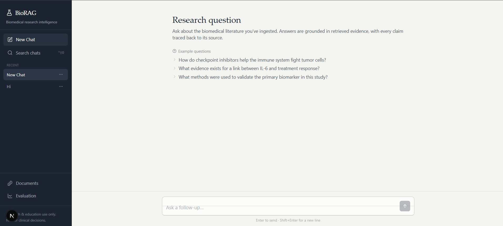
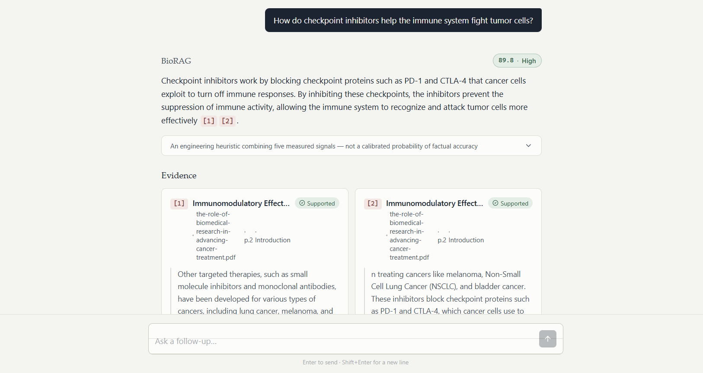
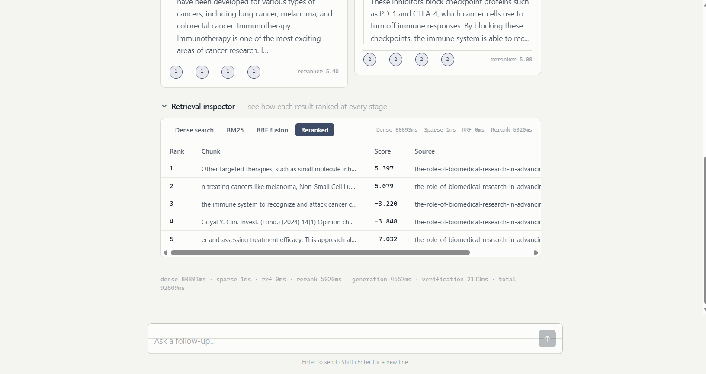

# BioRAG


## Biomedical Retrieval-Augmented Generation Platform for Scientific Literature

BioRAG is an end-to-end biomedical Retrieval-Augmented Generation (RAG) platform that enables researchers to upload scientific papers, retrieve relevant evidence using hybrid search, generate grounded answers with citations, verify supporting claims, and evaluate retrieval quality through an integrated benchmarking framework.

Unlike traditional chatbots, BioRAG prioritizes evidence-backed responses by combining dense semantic retrieval, lexical search, reranking, citation verification, and confidence estimation before generating an answer.

> **Disclaimer**
>
> BioRAG is intended for research and educational purposes only. It is **not** a medical diagnosis system, clinical decision support system, or a replacement for professional healthcare advice.

---
---

## Research Workspace



---
# Features

### Document Intelligence

- Upload PDF, TXT and Markdown documents
- Structure-aware document parsing
- Intelligent chunking
- Metadata extraction
- Document management interface

### Hybrid Retrieval

- Dense semantic retrieval using PubMedBERT embeddings
- Sparse lexical retrieval using BM25
- Reciprocal Rank Fusion (RRF)
- Cross-Encoder reranking

### Grounded Question Answering

- Context-aware answer generation
- Inline evidence citations
- Source attribution
- Retrieval inspection
- Confidence estimation

### Verification

- Claim extraction
- Citation verification
- Evidence consistency checks
- Confidence scoring

### Evaluation Framework

- Golden dataset benchmarking
- Retrieval ablation study
- Precision@K
- Recall@K
- Mean Reciprocal Rank (MRR)
- Faithfulness
- Relevance
- Correctness
- Citation validity
- Hallucination analysis

### Research Workspace

- Modern Next.js interface
- Interactive chat
- Document management
- Evaluation dashboard
- Retrieval inspector
- Confidence visualization

---

# Architecture

```
                    Scientific Papers
                            │
                            ▼
                     Document Parsing
                            │
                            ▼
                  Structure-aware Chunking
                            │
          ┌─────────────────┴─────────────────┐
          ▼                                   ▼
 PubMedBERT Embeddings                  BM25 Index
          │                                   │
          └───────────────┬───────────────────┘
                          ▼
              Reciprocal Rank Fusion
                          │
                          ▼
             Cross-Encoder Reranking
                          │
                          ▼
                 Context Construction
                          │
                          ▼
               Groq LLM Answer Generation
                          │
                          ▼
      Claim Extraction & Citation Verification
                          │
                          ▼
           Confidence Scoring & Final Answer
```

---

# Tech Stack

## Backend

- Python 3.11
- FastAPI
- LangChain
- ChromaDB
- SQLite
- PubMedBERT
- Sentence Transformers
- BM25
- Groq API

## Frontend

- Next.js
- React
- TypeScript
- Tailwind CSS

## Testing

- Pytest
- Offline evaluation framework
- End-to-end retrieval tests

---

# Repository Structure

```
BioRAG/
│
├── backend/
│   ├── app/
│   ├── tests/
│   ├── data/
│   └── requirements.txt
│
├── frontend/
│   ├── app/
│   ├── components/
│   ├── lib/
│   └── public/
│
├── docs/
│   └── architecture.md
│
└── README.md
```

---

# Getting Started

## Backend

```bash
cd backend

python -m venv venv

# Windows
venv\Scripts\activate

# Linux/macOS
source venv/bin/activate

pip install -r requirements.txt

cp .env.example .env

# Add your Groq API key
GROQ_API_KEY=your_key_here

uvicorn app.main:app --reload
```

Backend:

```
http://localhost:8000
```

---

## Frontend

```bash
cd frontend

npm install

cp .env.example .env.local

npm run dev
```

Frontend:

```
http://localhost:3000
```

---

# API Endpoints

| Endpoint | Description |
|----------|-------------|
| `POST /api/v1/documents/upload` | Upload research documents |
| `GET /api/v1/documents` | List uploaded documents |
| `POST /api/v1/query` | Ask questions over uploaded literature |
| `POST /api/v1/evaluation/run` | Run retrieval evaluation |

---

# Running Tests

```bash
cd backend

pytest -v
```

The evaluation framework benchmarks retrieval and generation quality using a configurable golden dataset.

---

# Screenshots

The main workspace provides an intuitive interface for interacting with uploaded scientific literature.


---

## Conversational Research Assistant

Ask questions naturally and receive grounded responses with citations and confidence estimates.



---

## Retrieval Inspector

Inspect dense retrieval, BM25 search, Reciprocal Rank Fusion, and cross-encoder reranking to understand how each response was generated.




---

# Roadmap

- ✅ Biomedical document ingestion
- ✅ Structure-aware chunking
- ✅ Dense + Sparse hybrid retrieval
- ✅ Reciprocal Rank Fusion
- ✅ Cross-Encoder reranking
- ✅ Grounded answer generation
- ✅ Citation verification
- ✅ Confidence scoring
- ✅ Evaluation framework
- ✅ Next.js research workspace

---

# Future Work

- Custom Changes 
- Docker & Docker Compose
- Kubernetes deployment
- CI/CD pipeline
- Multi-document conversations
- Knowledge graph integration
- Authentication & user workspaces
- Live streaming responses
- Model selection & routing

---

# License

MIT License

---

# Author

Built as an end-to-end AI engineering project demonstrating modern Retrieval-Augmented Generation (RAG), hybrid information retrieval, evidence verification, and full-stack AI application development.
